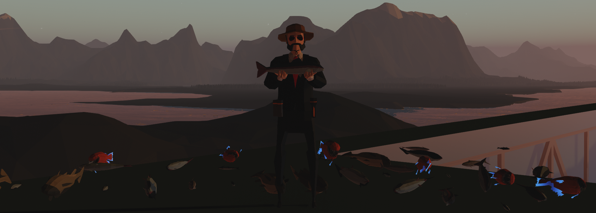

---

# 🐟 | Hunger Addon

## 📚 | Overview
This addon that adds a hunger system to Stormworks: Build and Rescue, making fishing more of a necessity than a desire.

This addon uses [Aurora Framework](https://github.com/Cuh4/AuroraFramework), a framework I created that tremendously helps with addon development.

Feel free to `git clone`, or even contribute.

## ❓ | Requirements
- **Python 3.12.1+**
- **Stormworks: Build and Rescue** (game)

## 💻 | Setup
### 😎 | Simple
1) [Subscribe to the addon from the Steam workshop.](https://steamcommunity.com/sharedfiles/filedetails/?id=3156992745)
2) Create a new save, but before loading it, enable this addon.
3) When enabling the addon, you will see a cog icon. Click it to open up the options menu, then configure the addon to however you desire. The default options are recommended.
4) Load into the save and have fun.

### 🤓 | Advanced
1) Run `git clone "https://github.com/cuhHub/SWHungerAddon.git"`
2) Optionally, change the addon name in `playlist.xml` to whatever you desire.
3) Run `py combiner.py` to merge all of the code into a `script.lua` file. Feel free to stop it with `CTRL + C` once it has been created.
4) Run `sync.bat`. This will effectively clone the addon into `%appdata%/Stormworks/data/missions`, allowing you to use this addon in-game regardless of what directory the addon is in.
5) Create a save with the addon enabled, and have fun with the addon.

## ✨ | Credit
- **Cuh4** ([GitHub](https://github.com/Cuh4)) 